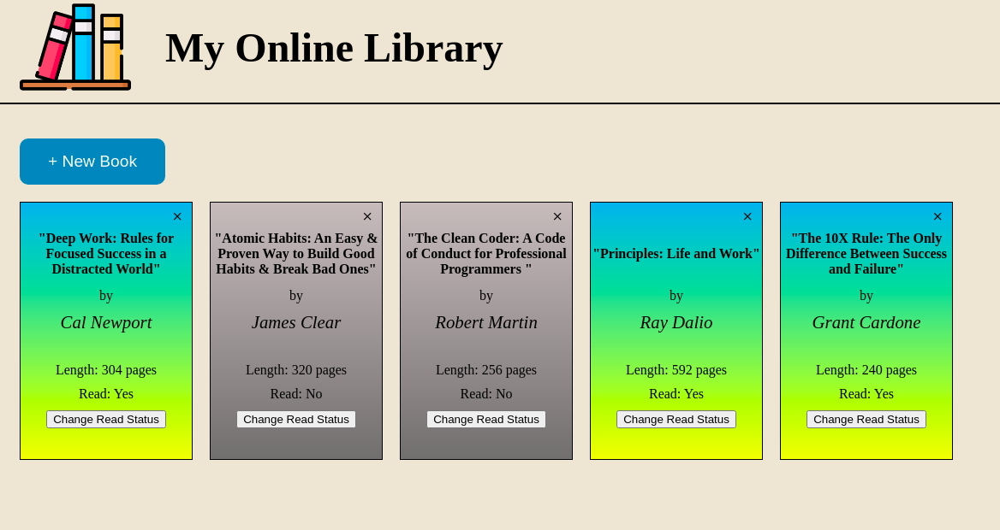

# library

[Live Page](https://sebastienpj.github.io/library/)

Here is my solution to the Library project fron The Odin project.

This site will allow you to catalog your book collection by adding and removing books; and, the site also allows you mark your books as read or unread. The site uses the Web Storage API to store the data in local storage. All book lovers are welcomed! 

I used HTML, CSS/Flexbox, and Javascript to complete this project.

Topics learned/reinforced:
- Web Storage API
- Prototypal Inheritance using `Object.create`
- DOM Manipulation:
  - Selecting elements using Javascript
  - Adding and removing content from page 
  - Adding Event Listeners to DOM elements
- Organization
- Flexbox properties
- Arrow functions